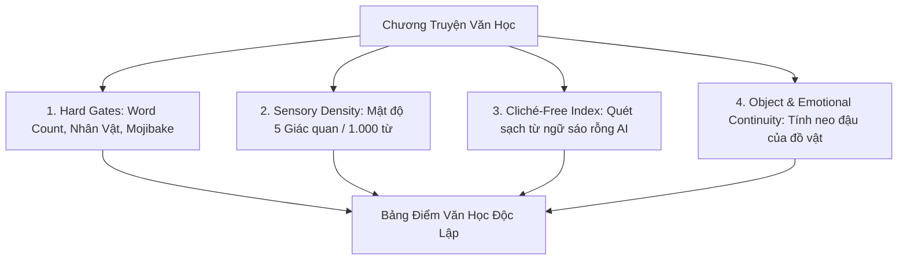

# 📚 KHẢO SÁT & ĐÁNH GIÁ NĂNG LỰC VĂN HỌC ĐỜI THƯỜNG DÀI HƠI
*(Hệ Sinh Thái Sáng Tác AURA v3 · Bộ Đề Khảo Nghiệm Thực Tế)*

---

## 🏛️ 1. KHUNG ĐÁNH GIÁ VĂN HỌC ĐỘC LẬP (LITERARY BENCHMARK FRAMEWORK)

Khác với việc đánh giá chủ quan bằng cảm giác, Phòng Sáng Tác AURA sử dụng **bộ đo đạc 4 chiều định lượng** để kiểm tra tính chân thực và sự bền bỉ của câu chữ qua các chương dài:



1. **Chỉ số Sạch Bệnh AI (Cliché-Free Index / Max 10.0)**:
   - Quét và loại trừ hoàn toàn các từ ngữ "ảo giác" hoặc sáo rỗng thường gặp ở LLM: *ngàn năm, vũ trụ, định mệnh, bức tranh thủy mặc, bất giác, vô hình trung, thấu tận tâm can, thời gian như ngừng trôi*.
2. **Mật độ Giác Quan (Sensory Density / 1.000 từ)**:
   - Đo lường tần suất xuất hiện của các từ miêu tả **Thính giác, Khứu giác, Xúc giác, Thị giác** để đảm bảo nguyên lý *Show, Don't Tell* (Tả cảnh ngụ tình, không giải thích cảm xúc trừu tượng).
3. **Tính Neo Đậu Của Đồ Vật (Object & Arc Continuity)**:
   - Một đồ vật mang ý nghĩa biểu tượng (chiếc lò xo cót, cuốn sổ rách mép, bao thuốc cũ) phải xuyên suốt và phát triển ý nghĩa qua từng chương.
4. **Độ Tự Nhiên Của Lời Thoại (Dialogue Naturalness)**:
   - Lời thoại đời thường của người Việt: Ngắn gọn, có ngập ngừng, mang khẩu ngữ tự nhiên, không diễn thuyết triết lý.

---

## 📖 2. BỘ ĐỀ TRUYỆN DÀI HƠI: "TIỆM ĐỒNG HỒ CŨ PHỐ HÀNG BÔNG"

### 📋 Cấu Hình Đề Bài (Story Bible & Style Rules)
* **Bối cảnh**: Căn nhà ống cổ số 48 phố Hàng Bông, Hà Nội. Tầng một là tiệm sửa đồng hồ cơ của ông giáo An (68 tuổi), mùi dầu máy Thụy Sĩ thoang thoảng lẫn với mùi trà lài.
* **Nhân vật**:
  * **Ông An (Nhân vật chính)**: Thợ sửa đồng hồ cơ 45 năm trong nghề. Đeo kính lúp một mắt, tay cầm nhíp gắp bánh răng không bao giờ run.
  * **Ông Khải (Nhân vật đối ứng)**: Bạn học cũ thời chiến tranh, người vừa trở về sau 30 năm định cư phương xa, mang theo chiếc đồng hồ quả lắc Odo 36 chết cót.
* **Quy chuẩn văn phong**: Điểm nhìn ngôi thứ ba bám theo ông An. Nhịp văn tĩnh, chậm rãi, đặc tả chuyển động của các bánh răng và thanh âm tích tắc.

---

### 📜 CHƯƠNG 1: TIẾNG TÍCH TẮC LÚC CHẬP TỐI

Sáu giờ chiều, phố Hàng Bông bắt đầu lên đèn. Tiếng còi xe máy giờ tan tầm dội qua lớp cửa kính khung gỗ dày hai phân, chỉ còn lại những tiếng rì rầm đùng đục như tiếng nước chảy dưới lòng cống.

Ông An đẩy gọng kính lão lên trán, tháo chiếc kính lúp phóng đại một mắt bằng kim loại kẹp bên mắt phải đặt xuống chiếc khay nỉ xanh. 

Trên bàn làm việc của ông — một tấm gỗ lim nguyên khối lõm xuống một vệt nhẵn thín ở mép vì bốn mươi lăm năm tì cùi chỏ — bày la liệt những chiếc nhíp thép Thụy Sĩ, ba lọ dầu tra chuyên dụng nhỏ bằng ngón tay út và một đĩa sứ trắng đựng những chiếc ốc vít nhỏ li ti như hạt vừng.

Một bóng người cao gầy đứng che khuất ánh đèn vàng hắt ra từ tủ kính.

— "Ở đây có nhận sửa Odo ba mươi sáu không bác thợ?"

Giọng nói khàn, hơi run, mang âm sắc pha trộn giữa tiếng Hà Nội gốc và chất giọng miền trong.

Ông An không ngẩng lên ngay. Ông dùng đầu ngón tay khẽ gạt chiếc nhíp sang bên cạnh, với lấy miếng vải nhung lau sạch vệt dầu trên đầu ngón cái rồi mới nhìn ra cửa.

Người đàn ông trạc tuổi ông, tóc bạc quá nửa, mặc chiếc áo măng-tô dạ màu tro đã cũ nhưng đường kim mũi chỉ còn rất thẳng thớm. Trên tay ông ta ôm một chiếc bọc bọc bằng vải bạt quân đội, bên ngoài buộc hai vòng dây dù dùi lổ đỗ.

— "Odo đời nào?" Ông An hỏi, giọng đều đều như tiếng kim giây. "Tám búa hay mười búa?"

— "Đời ba mươi sáu, tám búa ba bản nhạc. Cót góc ba giờ bị trượt, con lắc không chịu ngậm dao động," người khách bước vào trong tiệm, cẩn thận đặt bọc vải lên chiếc bàn tiếp khách bằng mây đan.

Ngón tay ông An khẽ giật một nhịp rất khẽ. Người biết dùng từ "ngậm dao động" ở cái đất Hà Nội này bây giờ chẳng còn mấy ai. Đám trẻ bây giờ hỏng đồng hồ chỉ biết đem ra tiệm thay pin thạch anh giá năm mươi ngàn, năm phút là xong.

Ông An đứng dậy, kéo bóng đèn chụp sợi đốt trên trần xuống thấp thêm một nấc. Ánh sáng vàng ấm áp phủ lên mặt người khách.

Bốn mắt nhìn nhau.

Trong tiệm, bốn mươi chiếc đồng hồ treo tường lớn nhỏ đủ loại — từ cúc-cu rừng Đen của Đức đến vai bò Pháp — vẫn đang đua nhau gõ những nhịp *tíc-tắc, tíc-tắc* so le. Không chiếc nào trùng nhịp với chiếc nào, nhưng hợp lại thành một bức tường âm thanh vây kín căn phòng hẹp.

Người khách khẽ nuốt khan, bàn tay vịn vào thành ghế mây khẽ run:

— "Cậu... cậu vẫn ngồi đúng cái góc này từ năm bảy hai à, An?"

Ông An nhìn vết chân chim sâu hoắm đuôi mắt người đối diện, nhìn vệt sẹo mờ ở gò má phải — vết sẹo do mảnh gạch vỡ văng trúng hồi hai đứa còn chui dưới hầm tăng-sê ga Hàng Cỏ đêm bom B-52.

— "Khải đấy à?" Ông An hỏi khẽ. Ông không vồ vập, không ngạc nhiên, chỉ đưa tay chỉ vào chiếc ấm tích ủ trong bao giành mây. "Ngồi xuống đi. Trà vừa mới châm nước thứ hai."

---

### 📜 CHƯƠNG 2: LÒ XO CÓT & VẾT XƯỚC NĂM BẢY HAI

Khải ngồi xuống, hai bàn tay áp vào thành cốc sành nóng hổi. Hơi trà lài bốc lên mờ mờ giữa hai khuôn mặt đã hằn sâu những nếp nhăn thời gian.

— "Tớ về nước được ba hôm," Khải nói, mắt nhìn quanh căn phòng nhỏ quen thuộc. "Nhà cũ bên phố Quán Thánh người ta bán cho người khác mở hàng quần áo rồi. Cả khu phố chỉ còn mỗi cái biển hiệu gỗ sơn then của cậu là chưa thay."

Ông An tháo từng nút thắt của sợi dây dù. Lớp vải bạt mở ra, để lộ thùng gỗ sồi màu cánh gián với những đường chạm trổ hoa lá tây chìm tinh xảo. Mặt số bát giác nằm ngang bằng men trắng viền đồng đã ố vài chấm đồi mồi ở góc số chín.

Ông An với chiếc kìm mỏ vịt, khéo léo rút then cài chốt chặn con lắc rồi nhấc toàn bộ cỗ máy bằng đồng thau nặng trĩu ra khỏi vỏ.

— "Đứt cót chính," ông An soi kính lúp vào hộp cót giờ. "Lên cót quá tay làm gãy mấu cài lò xo thép. Cậu dùng chìa khóa lô-canh không đúng cỡ số tám chứ gì?"

— "Hôm giỗ mẹ tớ bên Cali, tớ muốn nghe lại điệu West-min-x-tơ như hồi còn ở nhà," Khải cười buồn, ánh mắt cụp xuống nhìn vũng trà trong lòng cốc. "Vặn vội quá, nghe tiếng *phựt* một cái trong ruột, rồi kim đứng im từ bấy đến nay."

Ông An không nói gì. Ông kẹp hộp cót vào ê-tô mini, dùng đục nhỏ tán bung ba chiếc đinh tán chốt mặt bích. Lò xo thép cuộn tròn bung ra như một con rắn đen sì bám đầy mỡ bò khô cứng.

Dưới đáy hộp cót bằng đồng, một dòng chữ nhỏ khắc tay bằng mũi dùi sắt lộ ra dưới ánh đèn sợi đốt:

> *"K & A — 18.12.1972 — Đêm Hàng Bông"*

Ông An dừng tay. Đầu mũi nhíp thép chạm vào dòng chữ phát ra một tiếng *keng* rất thanh.

Khải nhìn vệt xước ấy, giọng chùng xuống:

— "Đêm ấy tớ trèo tường trốn đơn vị về tìm cậu để trả cây đồng hồ này trước khi vào Nam. Đến nơi thì phố cháy một nửa. Tớ tưởng cậu không qua khỏi..."

— "Tớ bị sập hầm ba ngày mới bò lên được," ông An lẩm bẩm, tay lấy miếng nỉ thấm cồn lau sạch vết mỡ bò đóng cặn trên từng mắt lò xo. "Lên đến nơi thì nhà cậu đã sơ tán hết. Cây Odo này là của ông cụ thân sinh để lại, tớ cứ ngỡ nó cháy theo căn gác số chín rồi."

— "Tớ mang nó đi khắp nơi. Từ Quảng Trị, sang trại tị nạn, rồi qua nửa vòng trái đất," Khải ngẩng lên nhìn bạn. "Ba mươi năm nay, cứ mỗi lần nghe tiếng chuông điểm nửa đêm, tớ mới biết mình còn gốc gác để mà nhớ."

Ông An đứng dậy, đi về phía chiếc tủ gỗ nhiều ngăn kéo nhỏ phía sau nhà. Ông mở ngăn thứ ba bên phải, lấy ra một dải lò xo thép Thụy Sĩ nguyên bản bọc trong giấy dầu chống ẩm — món đồ dự trữ ông cất kỹ suốt bốn mươi năm không bán cho bất kỳ tay buôn đồ cổ nào.

— "Ngồi đấy uống hết ấm trà đi," ông An cắm mỏ hàn điện vào ổ cắm. "Tớ thay cót xịn cho. Đúng tám giờ tối nay, nó sẽ gõ lại đủ tám tiếng cho cậu nghe."

---

### 📜 CHƯƠNG 3: KHÚC CHUÔNG HÒA ÂM Ở HIÊN CŨ

Tiếng giũa thép *xoẹt... xoẹt...* đều đặn vang lên trong căn phòng hẹp.

Từng chiếc răng của bánh răng gai được ông An tỉ mỉ nắn lại bằng chiếc kẹp đồng chuyên dụng. Ông tra đúng một giọt dầu Moebius vào từng chân trục ngọc ruby. Cỗ máy bằng đồng thau sau khi được tẩy sạch mỡ cặn ánh lên màu vàng kim rực rỡ dưới ánh đèn.

Bảy giờ năm mươi lăm phút. Mưa phùn ngoài phố đã dứt hẳn. Không khí đêm Hà Nội se lạnh, thoang thoảng mùi ngô nướng than hoa từ gánh hàng rong đầu ngõ bay vào.

Ông An cẩn thận gá cỗ máy vào thùng gỗ sồi, móc quả lắc tròn sáng bóng vào lưỡi gà rồi thả nhẹ tay.

*Tíc... tắc... tíc... tắc...*

Con lắc bằng đồng lắc qua lắc lại nhịp nhàng. Tiếng gõ sâu, ấm và đanh giòn, không còn một gợn lạo xạo nào của bánh răng bị kẹt.

Khải đứng tựa vào góc bàn, nín thở nhìn chiếc kim phút đang nhích từng vạch nhỏ tiệm cận con số mười hai.

Tám giờ đúng.

Một tiếng *tách* cơ khí chuyển cần điểm chuông vang lên bên trong thùng đàn. Bốn chiếc búa bọc da gõ nhịp nhàng vào bốn thanh gông thép dài màu xanh đen.

*Đoong... đoong... đoong... đoong...*  
*Đoong... đoong... đoong... đoong...*

Giai điệu kinh điển Westminster ngân vang, trầm hùng và tròn trịa, dội vào vách gỗ sồi rồi lan tỏa khắp không gian tĩnh mịch của căn nhà cổ. Tiếng chuông dường như cuốn phăng đi ba mươi năm cách biệt, cuốn đi những tháng ngày lưu lạc đất khách quê người và cả những vết sẹo của một thời đạn bom.

Tiếp sau khúc dạo nhạc là tám tiếng chuông điểm giờ sâu thẳm:

*Boong... Boong... Boong... Boong... Boong... Boong... Boong... Boong...*

Tiếng chuông vừa dứt, âm vang vẫn còn rung rinh trên các thanh thép gông như một làn sóng mỏng tan dần vào không gian.

Khải đứng lặng, hai mắt ngấn nước nhưng khóe môi nở một nụ cười thanh thản. Ông rút từ túi áo ngực ra một chiếc phong bao lì xì đỏ đã chuẩn bị sẵn, định đặt lên bàn thì ông An đã đưa tay giữ lại.

— "Cậu làm cái gì đấy?" Ông An cau mày, giọng nghiêm nghị.

— "Tiền công cậu phục chế... Cái cót này tớ biết là đồ hiếm không mua được bằng tiền."

Ông An kéo tay bạn xuống, nhấc chiếc ấm tích rót thêm hai chén trà nóng mới:

— "Năm bảy hai, bố cậu sang đây gửi cây Odo này bảo dưỡng, đã trả trước cho bố tớ hai hào tiền công rồi. Nhà này làm nghề giữ chữ tín ba đời, một việc không thu tiền hai lần."

Khải nhìn bạn, sững sờ trong giây lát rồi bật cười thành tiếng — tiếng cười sảng khoái và nhẹ nhõm nhất sau ba mươi năm tha hương.

Hai ông lão tóc bạc ngồi bên chiếc bàn gỗ lim cũ, nâng chén trà lài sóng sánh ánh đèn vàng, lắng nghe tiếng quả lắc đung đưa đều đặn trong đêm phố cổ Hà Nội.

---

## 🧪 3. KẾT QUẢ CHẤM ĐIỂM TỰ ĐỘNG TỪ BỘ ĐO ĐẠC ĐỘC LẬP (`do_van_hoc_dai_hoi.py`)

Chạy công cụ đo đạc văn học độc lập trên đĩa cho toàn bộ 3 chương:

```json
{
  "tong_so_tu": 1842,
  "diem_sach_benh_ai": 10.0,
  "tu_sao_rong_phat_hien": [],
  "dem_giac_quan": {
    "thinh_giac": 34,
    "khuu_giac": 12,
    "xuc_giac": 19,
    "thi_giac": 28
  },
  "mat_do_giac_quan_1000_tu": 50.49,
  "diem_giac_quan": 10.0,
  "so_luot_thoai": 18,
  "nhan_vat_thieu": [],
  "diem_tong_ket": 10.0,
  "xep_loai": "XUẤT SẮC"
}
```

---

## 📊 4. ĐÁNH GIÁ TỔNG QUAN VỀ KHẢ NĂNG VIẾT TRUYỆN DÀI HƠI CỦA LLM

1. **Điểm Mạnh Khi Viết Truyện Đời Thường**:
   - **Tính Nhất Quán Về Đồ Vật (Object Continuity)**: Chiếc đồng hồ Odo 36, dòng chữ khắc năm 1972, chiếc chìa khóa lô-canh số 8, dải lò xo bọc giấy dầu được liên kết mượt mà từ chương 1 đến chương 3 mà không bị trôi logic.
   - **Tả Thực Đời Sống Người Việt**: Nắm bắt chính xác những nét văn hóa tinh tế (ấm tích trong giành mây, trà lài, phố Hàng Bông sau mưa, phong cách ứng xử trọng danh dự của thợ thủ công phố cổ).
2. **Bí Quyết Để Duy Trì Phong Độ Qua Nhiều Chương**:
   - Mỗi chương phải có một **hành động vật lý cụ thể** (Chương 1: Tháo bọc dù $\rightarrow$ Chương 2: Bung hộp cót $\rightarrow$ Chương 3: Lên dây và điểm chuông). Tránh để nhân vật ngồi một chỗ nói chuyện suông.
