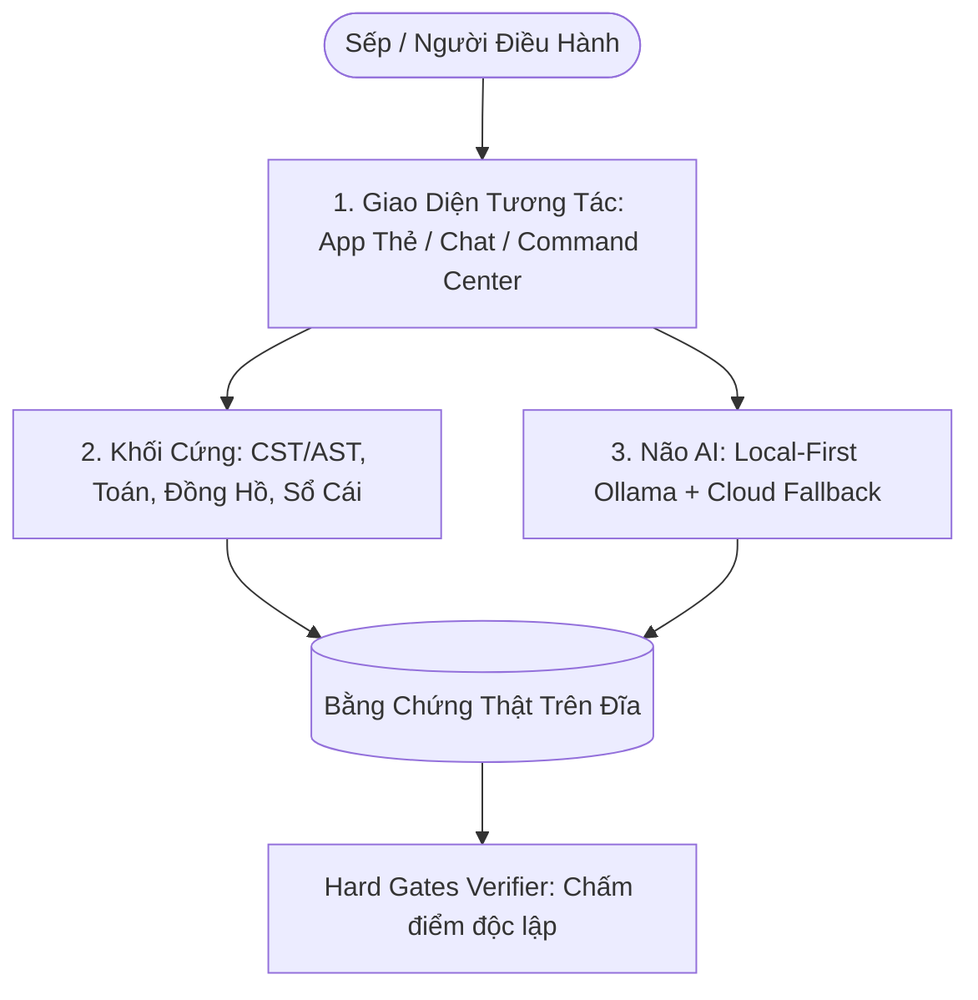

# 🧭 LỘ TRÌNH LÀM CHỦ AI TỪ GỐC RỄ & TIẾNG ANH THỰC CHIẾN
*(Dành riêng cho Sếp · Đúc kết từ Triết lý First-Principles & Bài học xương máu AURA v3)*

---

## 📖 MỤC LỤC
1. [Phần 1: Giải Mã Dự Án AURA v3 — Chúng Ta Thật Sự Đang Làm Gì?](#phần-1-giải-mã-dự-án-aura-v3--chúng-ta-thật-sự-đang-làm-gì)
2. [Phần 2: Lộ Trình Học AI Từ Cơ Bản Đến Làm Chủ (First-Principles)](#phần-2-lộ-trình-học-ai-từ-cơ-bản-đến-làm-chủ-first-principles)
3. [Phần 3: Lộ Trình Tiếng Anh Kỹ Thuật & Giao Tiếp Thực Chiến](#phần-3-lộ-trình-tiếng-anh-kỹ-thuật--giao-tiếp-thực-chiến)
4. [Phần 4: Kế Hoạch Hành Động 30 Phút Mỗi Ngày](#phần-4-kế-hoạch-hành-động-30-phút-mỗi-ngày)
5. [Phần 5: Kho Thuật Ngữ & 100 Mẫu Câu Tiếng Anh Thực Chiến](#phần-5-kho-thuật-ngữ--100-mẫu-câu-tiếng-anh-thực-chiến)

---

## 🏛️ PHẦN 1: GIẢI MÃ DỰ ÁN AURA v3 — CHÚNG TA THẬT SỰ ĐANG LÀM GÌ?

Cảm giác "mù mờ" xuất hiện khi một dự án có quá nhiều thuật ngữ và file mã nguồn chạy ngầm mà ta chưa thấy được **dòng chảy dữ liệu gốc**. 

AURA v3 thực chất được xây dựng trên **3 nguyên lý tối giản**:



### 1. Phân Biệt Hai Bán Cầu: "Mã Cứng" vs "Não AI"
* **Bán cầu Não AI (Probabilistic - Xác suất)**:
  * Sử dụng các mô hình LLM (như `qwen3.5:4b` chạy qua Ollama trên máy, hoặc Gemini/Claude).
  * **AI chỉ phụ trách**: Hiểu ngôn ngữ tự nhiên, tóm tắt, sáng tác kịch bản, phân loại ý định và giải thích logic.
* **Bán cầu Mã Cứng (Deterministic - Chắc chắn 100%)**:
  * **Đồng hồ (`core/dong_ho.py`)**: Lấy giờ thật từ Windows, tuyệt đối không hỏi AI *"hôm nay ngày mấy"* vì AI sẽ đoán mò và sai lệch.
  * **Phép tính (`core/may_tinh.py`)**: Chạy bằng Python thật (`1247 * 38 = 47386`), không nhờ AI tính nhẩm.
  * **Cây Thẻ AST (`libcst` trong `core/the_cst.py`)**: Dịch mã Python thành các khối thẻ trực quan và ngược lại mà **không làm mất một dòng chú thích hay cấu trúc gốc nào** (Lossless Roundtrip).

### 2. Triết Lý Local-First ("Trò làm trước, bí mới hỏi Thầy")
* Máy tính cá nhân (i5, 12GB RAM, không card rời) chạy mô hình nội bộ `qwen3.5:4b` qua Ollama (`core/local_first_gateway.py`).
* Tác vụ nhẹ $\rightarrow$ Trò tự giải quyết trên máy offline, tốc độ cao, 0 đồng chi phí, bảo mật tuyệt đối.
* Khi gặp bài toán tra cứu diện rộng hoặc câu hỏi quá phức tạp $\rightarrow$ Cổng tự động chuyển tiếp lên API Cloud ("Thầy").

### 3. Nguyên Tắc "Bằng Chứng Trên Đĩa" (`AGENTS.md`)
* Không bao giờ công nhận kết quả chỉ dựa vào lời nói bằng chữ của AI.
* Mọi hành động đều phải sinh ra **file thật trên đĩa, byte thật, mã băm SHA-256 thật** và được bộ kiểm tra độc lập (**Verifier**) chấm `PASS`.

---

## 🧠 PHẦN 2: LỘ TRÌNH HỌC AI TỪ CƠ BẢN ĐẾN LÀM CHỦ (FIRST-PRINCIPLES)

Lộ trình được thiết kế theo phương pháp **First-Principles (Nguyên lý đầu tiên)** của Andrej Karpathy: *Hiểu rõ bản chất toán học và dữ liệu thô trước khi dùng thư viện.*

```
[Giai Đoạn 1: Lõi LLM] ──➔ [Giai Đoạn 2: Prompting & RAG] ──➔ [Giai Đoạn 3: Multi-Agent] ──➔ [Giai Đoạn 4: Local AI]
```

### 🔹 GIAI ĐOẠN 1: Bản Chất Lõi Của Mô Hình Ngôn Ngữ (Tuần 1 – 2)
> [!NOTE]
> **Mục tiêu**: Hiểu AI "nghĩ" như thế nào để không bao giờ bị nó đánh lừa.

1. **Token & Tokenization (Số hóa chữ viết)**:
   * Máy tính không hiểu chữ cái tiếng Việt hay tiếng Anh. Nó chuyển văn bản thành các con số đại diện gọi là **Tokens**.
   * *Ví dụ*: Từ `"học lập trình"` $\rightarrow$ `[3452, 9812, 104]`.
   * *Bài học AURA*: Tiếng Việt ghép âm tốn nhiều token hơn tiếng Anh; từ đó hiểu cách đo tốc độ token/giây trong phòng **Gamma**.
2. **Cơ Chế Next-Token Prediction (Dự đoán từ tiếp theo)**:
   * Bản chất của LLM là một cỗ máy thống kê: *"Dựa vào 100 từ phía trước, xác suất từ tiếp theo xuất hiện là gì?"*.
   * Tham số `Temperature`:
     * `0.0`: Cực kỳ chính xác, nghiêm túc, thích hợp viết mã code và tính toán.
     * `0.7 - 0.9`: Sáng tạo, phong phú, thích hợp viết truyện và brainstorm kịch bản.
3. **Context Window (Cửa sổ ngữ cảnh)**:
   * Bộ nhớ ngắn hạn trong 1 phiên trò chuyện (4K, 8K, 32K tokens). 
   * Hiểu vì sao chat quá dài AI sẽ bắt đầu "quên", và cách AURA dùng `user_memory.py` cùng sổ cái `so_cai.jsonl` để tạo bộ nhớ vĩnh cửu.

---

### 🔹 GIAI ĐOẠN 2: Kỹ Nghệ Prompt & Ngăn Chặn Ảo Giác (Tuần 3 – 4)
> [!NOTE]
> **Mục tiêu**: Điều khiển AI chính xác như một lập trình viên bậc thầy.

1. **Cấu Trúc Prompt Chuẩn 4 Thành Phần**:
   * **Role (Vai trò)**: Đóng vai ai (AURA Writer, Delta Code Doctor, Zeta Scout...).
   * **Task (Nhiệm vụ)**: Mục tiêu cụ thể cần đạt được.
   * **Context (Ngữ cảnh/Dữ liệu)**: Tài liệu đầu vào, dữ kiện thực tế.
   * **Constraints (Ràng buộc)**: Cấm làm gì, định dạng đầu ra (JSON Schema / Markdown).
2. **Chain-of-Thought (Tư duy từng bước)**:
   * Yêu cầu AI *"Hãy phân tích từng bước logic trước khi đưa ra kết quả cuối cùng"*. Giúp giảm 80% tỷ lệ lỗi logic.
3. **RAG (Retrieval-Augmented Generation) & Chống Bịa Đặt**:
   * Cách phòng **Zeta (Scout)** hoạt động: Thay vì để AI tự bịa câu trả lời, hệ thống cào dữ liệu thật từ Internet $\rightarrow$ nạp vào prompt $\rightarrow$ AI đọc và trích dẫn URL nguồn.

---

### 🔹 GIAI ĐOẠN 3: Kiến Trúc 7 Đặc Nhiệm (Multi-Agent System) (Tuần 5 – 6)
> [!NOTE]
> **Mục tiêu**: Hiểu cách vận hành hệ thống 7 phòng ban độc lập.

1. ⚡ **AURA**: Trung tâm điều phối & Sáng tác kịch bản bám sát `bible.json`.
2. 🎬 **Alpha**: Studio Video dọc 60s (Ghép ảnh PIL Cards, đọc giọng SAPI, render FFmpeg).
3. 🧪 **Beta**: Phòng Sandbox thử nghiệm prompt và kịch bản giả lập.
4. 🔧 **Delta**: Bác sĩ mã nguồn (Khám bệnh AST, định vị lỗi E1, sinh bản vá Auto-Fix).
5. 📊 **Gamma**: Giám sát hiệu năng (Đo RAM, CPU, tốc độ token/s, báo cáo Hard Gates).
6. 🎵 **Omega**: Thủ thư quản trị Sổ cái bất biến `so_cai.jsonl` và Âm nhạc Maestro (-14 LUFS).
7. 🔍 **Zeta**: Trinh sát Scout tra cứu Internet và kiểm chứng nguồn tin.

---

## 🗣️ PHẦN 3: LỘ TRÌNH TIẾNG ANH KỸ THUẬT & GIAO TIẾP THỰC CHIẾN

Học tiếng Anh trong kỷ nguyên AI không học ngữ pháp khô khan, mà học qua **Ngữ cảnh thực tế & Giao tiếp 1-1 hàng ngày**.

```
[50 Thuật Ngữ Cốt Lõi] ──➔ [Mẫu Câu Điều Khiển AI] ──➔ [Luyện Phản Xạ 15 Phút/Ngày]
```

### 📚 1. Bảng 20 Thuật Ngữ Kỹ Thuật "Gối Đầu Giường"

| Thuật ngữ | Phiên âm | Nghĩa bản chất | Ngữ cảnh trong AURA |
| :--- | :--- | :--- | :--- |
| **Deterministic** | /dɪˌtɜːmɪˈnɪstɪk/ | Chắc chắn, luôn ra 1 kết quả cố định | Mã Python `2 + 2 = 4` |
| **Probabilistic** | /ˌprɒbəbɪˈlɪstɪk/ | Xác suất, có thể thay đổi | Câu trả lời của mô hình AI |
| **Prompt Leak** | /prɒmpt liːk/ | Rò rỉ lời dặn hệ thống | AI vô tình đọc luật mật ra ngoài |
| **Hallucination** | /həˌluːsɪˈneɪʃn/ | Ảo giác / Bịa đặt thông tin | AI nói sự kiện không có thật |
| **Lossless** | /ˈlɒsləs/ | Không mất mát dữ liệu | Mở file `.py` sang Thẻ và lưu lại |
| **Verifier** | /ˈverɪfaɪə(r)/ | Bộ kiểm định độc lập | Bộ chấm test đo kích thước file |
| **Latency** | /ˈleɪtənsi/ | Độ trễ / Thời gian phản hồi | Mất 42 ms để trả kết quả |
| **Artifact** | /ˈɑːtɪfækt/ | Sản phẩm vật lý trên đĩa | File `video.mp4`, file `main.py` |
| **Append-only** | /əˈpend ˈəʊnli/ | Chỉ ghi thêm vào cuối, không sửa | Sổ cái `so_cai.jsonl` |
| **Benchmark** | /ˈbentʃmɑːk/ | Tiêu chuẩn đo lường hiệu năng | Bài test 714 test cases |
| **State Machine** | /steɪt məˈʃiːn/ | Máy trạng thái | Quản lý trạng thái App Thẻ |
| **Roundtrip** | /ˈraʊndtrɪp/ | Chu trình hai chiều hoàn hảo | Python $\rightarrow$ Thẻ $\rightarrow$ Python |
| **Sandbox** | /ˈsændbɒks/ | Môi trường cô lập an toàn | Chạy thử mã không sợ virus |
| **Refactor** | /ˌriːˈfæktə(r)/ | Tái cấu trúc mã nguồn sạch hơn | Rút gọn từ 339 file xuống 17 file |
| **Payload** | /ˈpeɪləʊd/ | Gói dữ liệu gửi qua mạng | Dữ liệu JSON gửi lên API |

---

### 💬 2. Mẫu Câu Ra Lệnh Cho AI Bằng Tiếng Anh (Prompting Patterns)

1. **Yêu cầu phân tích từng bước:**
   > *"Break down this task into step-by-step logic before writing any code."*  
   > *(Hãy chia nhỏ nhiệm vụ này thành từng bước logic trước khi viết code.)*

2. **Yêu cầu bằng chứng xác thực trên đĩa:**
   > *"Provide hard evidence on disk with SHA-256 hash before declaring success."*  
   > *(Hãy cung cấp bằng chứng thật trên đĩa kèm mã hash SHA-256 trước khi báo thành công.)*

3. **Chống ảo giác và bịa đặt:**
   > *"Do not hallucinate. If you cannot find verified sources, explicitly say 'I cannot find it'."*  
   > *(Không được bịa đặt. Nếu không tìm thấy nguồn tin xác thực, hãy nói rõ 'Tôi không tìm thấy'.)*

4. **Định dạng cấu trúc chuẩn:**
   > *"Format the response strictly as a JSON object matching this schema."*  
   > *(Hãy định dạng phản hồi chuẩn xác theo cấu trúc JSON này.)*

---

### 🗣️ 3. Mẫu Câu Giao Tiếp Công Việc Hàng Ngày (Daily Conversation)

1. *"Let's review the system architecture and memory usage."*  
   *(Hãy cùng xem lại kiến trúc hệ thống và mức tiêu thụ bộ nhớ.)*
2. *"What is the root cause of this runtime exception?"*  
   *(Nguyên nhân gốc rễ của lỗi runtime này là gì?)*
3. *"Is there any latency bottleneck in this pipeline?"*  
   *(Có điểm nghẽn độ trễ nào trong quy trình này không?)*
4. *"Everything is fully tested and verified on disk. We are ready to deploy."*  
   *(Mọi thứ đã được kiểm thử và xác thực trên đĩa. Chúng ta đã sẵn sàng triển khai.)*

---

## ⏱️ PHẦN 4: KẾ HOẠCH HÀNH ĐỘNG 30 PHÚT MỖI NGÀY

```
┌─────────────────────────────────────────────────────────────┐
│ 📅 15 PHÚT ĐẦU: HỌC BẢN CHẤT AI (FIRST-PRINCIPLES)         │
│ • Mở 1 tệp mã trong AURA (như `core/local_first_gateway.py` │
│   hoặc `data/omega/so_cai.jsonl`) để xem cách dữ liệu chạy. │
│ • Xem 1 video giải thích từ 3Blue1Brown hoặc Karpathy.      │
├─────────────────────────────────────────────────────────────┤
│ 🗣️ 15 PHÚT SAU: THỰC HÀNH TIẾNG ANH 1-1 VỚI AURA           │
│ • Bật AURA Chat / Bàn làm việc, gõ câu lệnh bằng tiếng Anh. │
│ • Luyện tập với câu mở đầu:                                 │
│   "AURA, let's practice daily English conversation.         │
│    Please correct any grammar or pronunciation mistakes."   │
└─────────────────────────────────────────────────────────────┘
```

---

## 🎁 PHẦN 5: TÀI NGUYÊN HỌC TẬP TINH GỌN (TOP RECOMMENDATIONS)

1. **Andrej Karpathy (Cựu Giám đốc AI Tesla / Đồng sáng lập OpenAI)**:
   * Chuỗi video: *"Neural Networks: Zero to Hero"* (Cách tự dựng mô hình AI từ 0).
   * Video nền tảng: *"State of GPT"* & *"Intro to Large Language Models"*.
2. **3Blue1Brown (Grant Sanderson)**:
   * Chuỗi video: *"Neural Networks & Deep Learning"* (Trực quan hóa ma trận số và cơ chế Attention đỉnh cao nhất).
3. **Thực hành trực tiếp trên AURA v3**:
   * Sử dụng **App Thẻ v1** (`start_the_app_day_du.bat`) để xem trực quan hóa AST.
   * Sử dụng **AURA Command Center** (`start_app_noi_bo.bat`) để quan sát 7 Đặc Nhiệm phối hợp thời gian thực.

---
*Tài liệu được lưu trữ vĩnh viễn tại `docs/LO_TRINH_HOC_AI_VA_TIENG_ANH.md` trên hệ thống AURA v3.*
